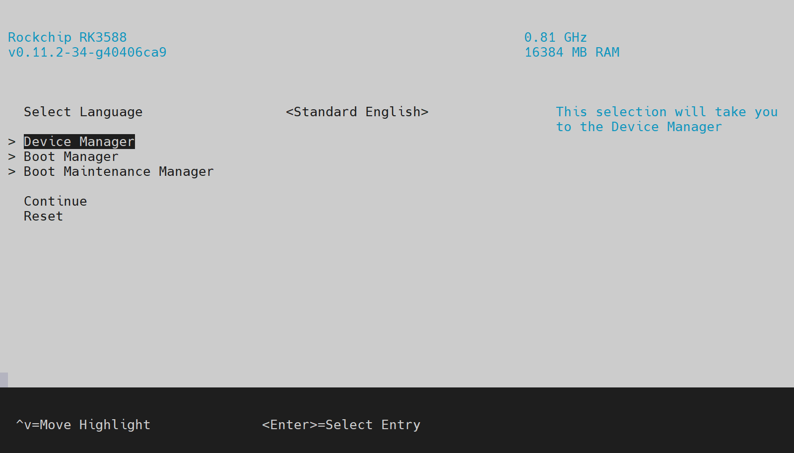

# EDK2 UEFI firmware for Rockchip RK3588 platforms
This repository contains an UEFI firmware implementation based on EDK2 for various RK3588 boards.

It delivers a PC-like standardized boot experience, supporting multiple operating systems, such as Windows, Linux, BSD and VMware ESXi.



# Supported platforms
Support levels are categorized into two tiers: Platinum and Bronze.

Platinum devices are considered to have the best overall support, based on factors such as:
- Device Tree and peripherals compatible with mainline Linux. [**Required**]
- Active interest from the vendor in supporting their hardware.
- Hardware design choices:
  - If an Ethernet port is present, Realtek PCIe NIC or integrated GMAC. [**Required**]
  - SPI NOR flash for dedicated firmware storage. [Preferred]

Bronze devices may have limitations such as:
- Missing one or more required features listed above.
- Low interest from vendors and/or the community.
- Lack of proper validation, potentially affecting functionality.

Note that this list is subject to change at any time as devices gain better support or fall behind.

## Platinum
- [Radxa ROCK 5B](https://radxa.com/products/rock5/5b/)
- [Radxa ROCK 5A](https://radxa.com/products/rock5/5a/)
- [Radxa ROCK 5 ITX](https://radxa.com/products/rock5/5itx/)
- [Orange Pi 5](http://www.orangepi.org/html/hardWare/computerAndMicrocontrollers/details/Orange-Pi-5.html)
- [Orange Pi 5 Plus](http://www.orangepi.org/html/hardWare/computerAndMicrocontrollers/details/Orange-Pi-5-plus.html)
- [Khadas Edge2](https://www.khadas.com/edge2)
- [BuzzTV P6](https://buzztvglobal.com/products/powerstation-6)
- [FriendlyELEC NanoPC T6](https://wiki.friendlyelec.com/wiki/index.php/NanoPC-T6)
- [FriendlyELEC NanoPi R6C](https://wiki.friendlyelec.com/wiki/index.php/NanoPi_R6C)
- [FriendlyELEC NanoPi R6S](https://wiki.friendlyelec.com/wiki/index.php/NanoPi_R6S)
- [FriendlyELEC NanoPC CM3588-NAS](https://wiki.friendlyelec.com/wiki/index.php/CM3588_NAS_Kit)
- [ameriDroid Indiedroid Nova](https://indiedroid.us)

## Bronze
- [Radxa ROCK 5B+](https://radxa.com/products/rock5/5bp)
- [Fydetab Duo](https://fydetabduo.com/)
- [Firefly AIO-3588Q](https://en.t-firefly.com/product/industry/aio3588q)
- [Firefly ITX-3588J](https://en.t-firefly.com/product/industry/itx3588j)
- [Firefly ROC-RK3588S-PC](https://en.t-firefly.com/product/industry/rocrk3588spc) / [StationPC Station M3](https://www.stationpc.com/product/stationm3)
- [Mekotronics R58X](https://www.mekotronics.com/h-pd-75.html)
- [Mekotronics R58 Mini](https://www.mekotronics.com/h-pd-76.html)
- [Mixtile Blade 3](https://www.mixtile.com/blade-3)
- [FriendlyELEC NanoPi M6](https://wiki.friendlyelec.com/wiki/index.php/NanoPi_M6)
- [Hinlink H88K](http://www.hinlink.com)

# Supported OSes
## In ACPI mode
| OS | Version | Tested/supported hardware | Notes |
| --- | --- | --- | --- |
| Windows | 11 | [Status](https://github.com/worproject/Rockchip-Windows-Drivers#hardware-support-status) ||
| NetBSD | 10 | Display, UART, USB, PCIe (incl. NVME), SATA, eMMC, GMAC Ethernet ||
| VMware ESXi Arm Fling | >= 1.12 | Display, USB | * PCIe devices will hang at boot, need to disable in settings or leave the ports empty.<br>* GMAC Ethernet gets detected but does not work. |
| Linux | tested Ubuntu 22.04, kernel 5.15.0-75-generic | Display, UART, USB, PCIe (incl. NVME & Ethernet), SATA | For full hardware functionality, use a kernel with RK3588 support and switch to Device Tree mode. |

> [!NOTE]
> ACPI support is only being developed and tested against Windows. There are no plans to further improve functionality for other OSes. Consider using Device Tree instead (where applicable, for instance Linux).

## In Device Tree mode
### Vendor compatibility mode
| OS | Version | Tested/supported hardware | Notes |
| --- | --- | --- | --- |
| Rockchip SDK Linux | Kernel 5.10/6.1<br> Tested with:<br> - [Armbian rk3588-live-iso](https://github.com/amazingfate/rk3588-live-iso) | Platform-dependent, most peripherals work. | If using a different kernel, see [Device Tree configuration](#device-tree-configuration). |

### Mainline compatibility mode
| OS | Version | Tested/supported hardware | Notes |
| --- | --- | --- | --- |
| Generic upstream Linux | Kernel 6.10 or newer.<br> Tested with:<br> - Ubuntu 24.10<br> - Fedora Workstation 41<br> - Fedora Workstation Rawhide | Platform and kernel version dependent, see [Collabora's RK3588 upstream status](https://gitlab.collabora.com/hardware-enablement/rockchip-3588/notes-for-rockchip-3588/-/blob/main/mainline-status.md). | * Kernels older than 6.15 lack display output. To work around this, see: [Device Tree configuration](#device-tree-configuration). |

> [!NOTE]
> Mainline support is only available on [Platinum](#platinum) platforms.

# Supported peripherals in UEFI

> [!NOTE]
> Applicable to all platforms unless otherwise noted.
>
> Only devices relevant to the firmware itself (not OS) are listed below.

| Device | Status | Notes |
| --- | --- | --- |
| USB 3 / 2.0 / 1.1                     | 🟢 Working     | Host-mode only, USB 3 devices connected to a Type-C port only work in one orientation. |
| PCIe 3.0 / 2.1                        | 🟢 Working     | |
| SATA                                  | 🟢 Working     | |
| SD/eMMC                               | 🟢 Working     | |
| HDMI output                           | 🟢 Working     | |
| DisplayPort output (USB-C)            | 🟡 Partial     | No hot-plug detect & EDID. Only works in one orientation of the Type-C port. Some displays may not work regardless. |
| eDP output                            | 🟡 Partial     | Disabled, requires manual configuration depending on the platform and panel. |
| DSI output                            | 🟢 Working     | Only enabled on Fydetab Duo. Requires manual configuration depending on the platform and panel. |
| GMAC Ethernet                         | 🟢 Working     | |
| Realtek PCIe Ethernet                 | 🟢 Working     | Some platforms don't have MAC addresses set, networking may not work in that case. |
| Low-speed (GPIO/UART/I2C/SPI/PWM)     | 🟢 Working     | UART2 console available at 1500000 baud rate |
| SPI NOR Flash                         | 🟢 Working     | |
| HYM8563 real-time clock               | 🟢 Working     | |
| RNG                                   | 🟢 Working     | |
| Cooling fan                           | 🟢 Working     | Supported on most platforms. Fan connector where present, otherwise available at the GPIO header for 3-pin PWM fans (do *not* connect 2-pin fans there!):<br>* Orange Pi 5: `GPIO4_B2`<br>* Indiedroid Nova: `GPIO4_B4` |
| Status LED                            | 🟢 Working     | |
| Voltage regulators (RK806/RK860)      | 🟢 Working     | |
| FUSB302 USB Type-C Controller         | 🔴 Not working | Required for PD negotiation and connector orientation switching |

# Getting started
## 1. Requirements
* One of the [supported devices](#supported-platforms).
* Storage for the firmware: SPI NOR flash (included with some devices), SD card or eMMC.
* Quality power supply that can provide at least 15 W. Depending on the peripherals you use, more may be needed.

  Note: on Mixtile Blade 3, a fixed voltage *higher than* 5V must be supplied. The board cannot power any external peripherals if the input voltage is just 5V. USB-PD negotiation is not supported by firmware.
* HDMI (preferred) or DisplayPort (USB-C) screen.
* Optionally, if display is not available or for debugging purposes, an UART adapter capable of 1500000 baud rate (e.g. USB CH340, CP2104).

## 2. Download the firmware image
The latest version can be obtained from <https://github.com/edk2-porting/edk2-rk3588/releases>.

If your platform is not yet supported, using an image meant for another device is **NOT** recommended. Although they are generally similar, voltage setup can happen to be different and you may risk damaging the board. External peripherals are unlikely to work either.

## 3. Flash the firmware
UEFI can be flashed to either an SPI NOR flash, SD card or eMMC module:
* For removable SD or eMMC (easiest), you can simply use balenaEtcher, RPi Imager or dd.
* For SPI NOR or soldered eMMC, instructions can be found at: <https://docs.radxa.com/en/rock5/lowlevel-development/bootloader_spi_flash>.

  In short, you can flash the image from Linux booted on the device or by using RKDevTool on another computer. The latter requires entering Maskrom mode on the device. The way to do this slightly varies across platforms, refer to your vendor documentation.

**Warning:** these operations will erase data on the storage device. Make a backup first!

If you wish to have both UEFI and an OS on the same SD or eMMC device: flash UEFI first, then create any additional partitions without touching the first, reserved one. Steps for updating the firmware in this case can be found [here](#updating-the-firmware).

Note: Using SPI NOR (if present) is recommeded, as it leaves the other storage options free for other purposes. Additionally, SD/eMMC will limit the firmware's ability to access its own storage (variable store) when an OS is running. This feature is mostly used by OS installers to create the boot menu options, it is not mandatory.

## 4. Connect peripherals and power on the device
If the flashing process has been done correctly, you should see the status LED blinking (if present), and shortly after, the platform's boot logo with a progress bar at the bottom on the connected display.

At this stage, you can press <kbd>Esc</kbd> to enter the firmware setup, <kbd>F1</kbd> to launch the UEFI Shell, or, provided you also have an UEFI bootloader/app on a storage device, you can let the system automatically run that, which is the default behavior if no action is taken.

Check the [Supported OSes](#supported-oses) and [Supported peripherals in UEFI](#supported-peripherals-in-uefi) sections to see what's currently possible with this firmware.

Also check the configuration options described below, some of which may need to be changed depending on the OS used.

If you experience any issues, please see the [Troubleshooting](#troubleshooting) section.

# Configuration settings
The UEFI provides a few configuration options, like CPU frequency, PCIe/SATA selection for an M.2 port, fan control, etc. These can be viewed and changed using the UI configuration menu (under `Device Manager`->`Rockchip Platform Configuration`).

Configuration through the user interface is fairly straightforward and help/navigation information is provided around the menus.

## Tips
### Boot time optimization
* If there are unused M.2/PCIe slots, you can disable them to skip initialization: `Device Manager`->`Rockchip Platform Configuration`->`PCIe/SATA/USB Combo PIPE PHY` and set the relevant PHYs to `Unconnected`. Do the same for `PCI Express 3.0` by setting `Support State` to `Disabled`.

* Auto boot time-out can be decreased from `Boot Maintenance Manager`.

* If network boot is not used, it can be disabled: `Device Manager`->`Network Stack Configuration` then uncheck `Network Stack`.

* If you do not need the ability to hot-plug displays or use DisplayPort while in the firmware: `Device Manager`->`Rockchip Platform Configuration`->`Display` and set `Force Output` to `Disabled`. This will skip display initialization when none is connected.

* By default, the firmware connects all boot devices regardless of whether they are needed for the current boot. This is done to address potential compatibility issues and generally takes a negligible amount of time, thus it is recommended to not change it. However, it is still possible to do so: `Boot Maintenance Manager`->`Boot Discovery Policy`.

### Linux boot
* If you're getting a Synchronous Exception when booting certain distros, go to `Device Manager`->`EFI Memory Attribute Protocol` and uncheck `Enable Protocol`.

## Device Tree configuration
For rich Linux support, it is recommended to enable Device Tree mode. You can do so by going to `Device Manager`->`Rockchip Platform Configuration`->`ACPI / Device Tree` and setting `Config Table Mode` to `Device Tree`.

The firmware provides two compatibility modes:
* `Vendor` - compatible with Rockchip SDK Linux 5.10/6.1 kernel only.
* `Mainline` - compatible with generic upstream Linux 6.10 or newer kernel. This option is under active development and may lack certain features. Therefore, it is always recommended to use the latest kernel and firmware available in order to benefit from better device support.

[Platinum](#platinum) platforms will have the `Mainline` option enabled by default, while [Bronze](#bronze) ones will fall back to `Vendor`.

> [!TIP]
> In `Mainline` mode with generic Linux kernels older than 6.15, the HDMI output will not be usable. To use the UEFI-initialized display instead, go to `Device Manager`->`Rockchip Platform Configuration`->`ACPI / Device Tree` and enable `Force UEFI GOP Display`. Note that GPU acceleration cannot work in this mode.

### Custom Device Tree Blob (DTB) override and overlays
It is also possible to provide a custom DTB and overlays. This is useful in cases where the firmware DTB is outdated, does not match the kernel used or for testing purposes. To enable overrides, go to `Device Manager`->`Rockchip Platform Configuration`->`ACPI / Device Tree` and set `Support DTB override & overlays` to `Enabled`.

The firmware will now look for overrides in all supported file systems / partitions (FAT, ext4) on the selected boot device.

**Important:**
* The paths below are relative to the root of the partition. They must not be inside any sub-directory.
* All overrides (base DTB and overlays) must be stored within a single partition. Using a base DTB from one partition and overlays from another is not allowed.

The base DTB can be placed in:
* `\dtb`
* `\dtb\base`
* `\dtb\rockchip` - Fedora images have the kernel DTBs in this location on the second ext4 boot partition.

and must have the `<PLATFORM-DT-NAME>.dtb` file name.

The overlays can be placed in:
* `\dtb\overlays` - will be applied first, regardless of the platform.
* `\dtb\overlays\<PLATFORM-DT-NAME>` - will be applied only to the specified platform.

and must have the `.dtbo` extension.

In addition to the default paths above, it is possible to specify custom ones via the `Preferred Base DTB Path` and `Preferred Overlays Path` setup options in the menu described above.

`<PLATFORM-DT-NAME>` can be:
| Name                                    | Platform                      |
| --------------------------------------- | ----------------------------- |
| `rk3588-rock-5b`                        | ROCK 5B                       |
| `rk3588-rock-5bp`                       | ROCK 5B+                      |
| `rk3588s-rock-5a`                       | ROCK 5A                       |
| `rk3588-rock-5-itx`                     | ROCK 5 ITX                    |
| `rk3588s-orangepi-5`                    | Orange Pi 5                   |
| `rk3588-orangepi-5-plus`                | Orange Pi 5 Plus              |
| `rk3588s-9tripod-linux`                 | Indiedroid Nova               |
| `rk3588s-fydetab-duo`                   | Fydetab Duo                   |
| `rk3588-buzztv-p6`                      | PowerStation 6                |
| `aio-3588q`                             | Firefly AIO-3588Q             |
| `itx-3588j`                             | Firefly ITX-3588J             |
| `roc-rk3588s-pc`                        | ROC-RK3588S-PC / Station M3   |
| `rk3588-blueberry-edge-v12-linux`       | R58X (v1.2)                   |
| `rk3588-blueberry-minipc-linux`         | R58 Mini                      |
| `rk3588s-khadas-edge2`                  | Edge2                         |
| `rk3588-blade3-v101-linux`              | Blade 3                       |
| `rk3588-nanopc-t6`                      | NanoPC T6                     |
| `rk3588-nanopc-cm3588-nas`              | NanoPC CM3588-NAS             |
| `rk3588s-nanopi-r6c`                    | NanoPi R6C                    |
| `rk3588s-nanopi-r6s`                    | NanoPi R6S                    |
| `rk3588s-nanopi-m6`                     | NanoPi M6                     |
| `rk3588-hinlink-h88k`                   | H88K                          |

**Notes:**
* The firmware applies some fix-ups to the DTB depending on the user settings (e.g. PCIe/SATA/USB selection, making SATA overlays redundant). These fix-ups are not applied when providing overrides by other means, such as the Grub `devicetree` command.

* In the absence of a base DTB override, the overlays are applied on top of the firmware-provided DTB.

* If the application of an overlay fails (e.g. due to incompatibility with the base DTB), all other overlays are discarded.

* If the base DTB override is invalid, the firmware-provided one will be passed to the OS instead.

* This process is logged to the [serial console](#advanced-troubleshooting). It is the only way to see potential errors.

# Updating the firmware
If the storage is only used for UEFI and nothing else, simply download the latest image and flash it as described in the [Getting started](#getting-started) section.

If it is also used by an OS and has additional partitions, only part of the image needs to be applied. This can be done with the `dd` tool:
```bash
dd if=FIRMWARE.img of=DESTINATION bs=512 skip=64 seek=64 conv=notrunc
```

`FIRMWARE.img` is the firmware image for your platform. E.g. `edge2_UEFI_Release_v0.8.img`.

`DESTINATION` is the destination storage that you wish to update the firmware on. E.g. `/dev/sdb`.

Here we skip the GPT and copy the firmware starting at offset 0x8000 (`64` blocks * `512` bytes block size) until its end. See [Flash layout](#flash-layout) for more details.

## Flash SPI NOR from the UEFI Shell
1) Copy the firmware image to a FAT32 partition on a storage drive and connect it to the device.

2) Launch the UEFI Shell (press <kbd>F1</kbd> during boot or go to `Boot Manager`->`UEFI Shell`).

3) Navigate to the partition / file system containing the firmware image:
   * Use the `map` command to list all mounted file systems, e.g. `fs0:`, `fs1:`, etc. Type the file system name and press <kbd>Enter</kbd> to change directory to it.

   * If you're unsure which file system to use, run `ls fsX:` (replace `X` with the actual number) to list its contents.

4) Run `sf updatefile FIRMWARE.img 0x0` and wait for the update process to complete.

5) Reboot the device.

# Troubleshooting

> [!IMPORTANT]
> First of all, make sure your device can only possibly load the UEFI firmware and nothing else.
>
> **U-Boot must not be present on either SPI NOR, SD or eMMC, otherwise it could take precedence and cause issues.**

Below you can find some basic debugging information. If none of this helps, please see the [Advanced troubleshooting](#advanced-troubleshooting) section.

## Meaning of the Status LED
If your device has an activity LED, the firmware will blink it in different patterns to indicate the current system status.

1. Immediately after power on, the LED should start pulsing quickly. This indicates that the firmware is initializing.

2. After initialization (usually takes less than 5 seconds), the LED will switch to a short pulsing every 2 seconds or so. This indicates that the firmware is ready and waiting for user action or the countdown to boot automatically. The display output should also be enabled at this point.

3. When the firmware boots an OS and is about to exit, the LED will stop blinking.

If the LED:
* does not light up after power on, this means the firmware has not managed to load up at all.
* gets stuck in either on or off state after blinking a few times and never recovers, something went wrong and the firmware has crashed or frozen.

  Note that it is only expected to stop as described at point 3) above.

## Recovery
In case you don't have easy access to the MaskROM button, UEFI provides a boot option for that purpose, accessible either via the Boot Manager or <kbd>F4</kbd> key during splash screen.

Additionally, holding the Recovery (or volume up) button while powering on the device will also enter MaskROM mode.

## Common issues
### Nothing shows up on the screen
Make sure you've flashed the firmware correctly and that it is the version designed for your device. In most cases this is the culprit.

Assuming the firmware loads fine:
* The display must support a resolution of at least 640 x 480 at 60 Hz.

* Try booting without any display connected, then plug it in after a couple of seconds (when the status LED pattern changes). This will force the firmware to output at the minimum supported resolution. You can then increase the resolution by going to `Device Manager`->`Rockchip Platform Configuration`->`Display`.

* If you're using USB-C to DisplayPort, only one orientation of the USB-C connector will work. Check both.

If you are still not able to get any display output, the only way to interact with UEFI is via the [serial console](#advanced-troubleshooting).

### Configuration settings do not get saved
This has been observed in cases where firmware was present on more than one device (SPI NOR, eMMC or SD). This is not a supported scenario, because UEFI will be unable to accurately determine the boot device it belongs to. The solution is to unplug or erase devices that may have other firmware on them.

### USB 3 devices do not work
* Try a different port.
* If you're using USB-C, 3.0 devices will only work in one orientation of the connector. Check both.
* Make sure the power supply and cable are good.

### Networking does not work
* Only integrated Gigabit Ethernet (GMAC), Realtek PCIe and USB controllers are supported.

* Some boards with Realtek NICs do not have a MAC address set at factory and will show-up as being all zeros in UEFI, possibly preventing the adapter from obtaining an IP address.

  You can easily fix this by writing the MAC address manually:

  1. Boot into Linux and open up a terminal. The commands below apply to Armbian with legacy kernel.

  2. Install the headers for your kernel version:
      ```bash
      sudo apt install -y linux-headers-legacy-rk35xx
      ```

  3. Clone Realtek PGTool and build the driver:
      ```bash
      git clone https://github.com/redchenjs/rtnicpg
      cd rtnicpg
      make
      ```

  4. Unload all Realtek modules and load the driver built above:
      ```bash
      sudo rmmod pgdrv
      sudo ./pgload.sh
      ```
      Note: make sure there aren't any remaining Realtek modules loaded after this, except for the new `pgdrv`.<br> If you have `r8125` built-in, you might have to reboot with `initcall_blacklist=rtl8125_init_module` as a kernel parameter (in Grub).

   5. Burn a MAC address into the eFuses:

      For only one NIC:
      ```bash
      sudo ./rtnicpg-aarch64-linux-gnu /efuse /nodeid 00E04C001234
      ```
      For two or more:
      ```bash
      sudo ./rtnicpg-aarch64-linux-gnu /efuse /# 1 /nodeid 00E04C001234
      sudo ./rtnicpg-aarch64-linux-gnu /efuse /# 2 /nodeid 00E04C001235
      ```
      `00E04C001234` is an example address. You can generate random and unique ones using: <https://www.macvendorlookup.com/mac-address-generator>

  **Note:** the number of eFuses is limited, thus MAC addresses can only be changed a few times.

### Wi-Fi / Bluetooth not working on mainline Linux
The most likely cause is missing upstream firmware support. Check `dmesg` for messages that indicate firmware load errors.

This can usually be fixed by manually copying the necessary blobs to `/usr/lib/firmware`.

For instance, on Khadas Edge2 with an onboard AP6275P module (BCM/SYN43752):
```bash
sudo wget https://github.com/armbian/firmware/raw/refs/heads/master/brcm/brcmfmac43752-pcie.bin -P /usr/lib/firmware/brcm/
sudo wget https://github.com/armbian/firmware/raw/refs/heads/master/brcm/brcmfmac43752-pcie.clm_blob -P /usr/lib/firmware/brcm/
sudo wget https://github.com/armbian/firmware/raw/refs/heads/master/brcm/brcmfmac43752-pcie.txt -P /usr/lib/firmware/brcm/
sudo wget https://github.com/armbian/firmware/raw/refs/heads/master/brcm/BCM4362A2.hcd -P /usr/lib/firmware/brcm/
```
then reboot.

## Advanced troubleshooting
The firmware will log detailed information to the serial console when using a debug version. See the [release notes](https://github.com/edk2-porting/edk2-rk3588/releases) for details on how to obtain this version.

1. The debug image needs to be flashed in place of the existing one.

2. Connect the **UART2** RX, TX and GND pins on your device (check vendor documentation) to the UART adapter on your other computer.

3. Open up a serial terminal (`PuTTY` on Windows, `stty` on Linux) set to 1500000 baud rate and 8n1 (default).

4. Power on the device.

You should be able to see many debug messages being printed to the console. If that's not the case, double check the connections (swap RX/TX), make sure the adapter is functional and configured correctly.

The logs should give an insight of what's going on. If you need help analyzing them, feel free to open an issue ticket.

# Reporting issues
You can open issues related to UEFI at <https://github.com/edk2-porting/edk2-rk3588/issues>.

Please include as many details as possible: expected behavior, what actually happens, steps to reproduce, [serial logs](#advanced-troubleshooting), etc.

Also check the existing issues in case yours might be already reported.

# Building
The firmware can only be built on Linux currently. For Windows use WSL.

1. Install required packages:

   For Ubuntu/Debian:
   ```bash
   sudo apt install git gcc g++ build-essential gcc-aarch64-linux-gnu acpica-tools python3-pyelftools uuid-dev python-is-python3 device-tree-compiler
   ```
   For Arch Linux:
   ```bash
   sudo pacman -Syu
   sudo pacman -S git base-devel gcc dtc aarch64-linux-gnu-binutils aarch64-linux-gnu-gcc aarch64-linux-gnu-glibc python python-pyelftools iasl --needed
   ```

2. Clone the repository:
   ```bash
   git clone https://github.com/edk2-porting/edk2-rk3588.git --recursive
   cd edk2-rk3588
   ```

3. Build UEFI (ROCK 5B for example, check [list of platform configs](https://github.com/edk2-porting/edk2-rk3588/tree/master/configs)):
   ```bash
   ./build.sh --device rock-5b --release Release # (or Debug)
   ```

If you get build errors, it is very likely that you're still missing some dependencies. The list of packages above is not complete and depending on the distro you may need to install additional ones. In most cases, looking up the error messages on the internet will point you at the right packages.

# Notes

## Flash layout
| Address    | Size       | Desc                  | File                   |
| ---------- | ---------- | --------------------- | ---------------------- |
| 0x00000000 | 0x00004400 | GPT Table             | rk3588_spi_nor_gpt.img |
| 0x00008000 |            | IDBlock               | idblock.bin            |
| 0x00100000 | 0x00500000 | BL33_AP_UEFI FV       | ${DEVICE}_EFI.itb      |
| 0x007C0000 | 0x00010000 | NV_VARIABLE_STORE     |                        |
| 0x007D0000 | 0x00010000 | NV_FTW_WORKING        |                        |
| 0x007E0000 | 0x00010000 | NV_FTW_SPARE          |                        |

The variable store is not included in the flash image, in order to prevent overwriting it and to maintain the user settings across updates.

The firmware expects these exact offsets, do not change them.

## Memory Map
| Address    | Size       | Desc                  | File                |
| ---------- | ---------  | --------------------- | ------------------- |
| 0x00040000 |            | ATF                   | bl31_0x00040000.bin |
| 0x000f0000 |            | ATF                   | bl31_0x000f0000.bin |
| 0x00200000 | 0x00500000 | UEFI FV               | BL33_AP_UEFI.Fv     |
| 0x007C0000 | 0x00010000 | NV_VARIABLE_STORE     |                     |
| 0x007D0000 | 0x00010000 | NV_FTW_WORKING        |                     |
| 0x007E0000 | 0x00010000 | NV_FTW_SPARE          |                     |
| 0x08400000 |            | OP-TEE                | bl32.bin            |
| 0xff100000 |            | ATF (PMU_MEM)         | bl31_0xff100000.bin |

## Licenses
Most of the UEFI code is licensed under the default EDK2 license, which is [BSD-2-Clause-Patent](https://github.com/tianocore/edk2/blob/master/License.txt).

Some components ported from Linux and Rockchip's U-Boot fork are licensed as **GPL-2.0** (check `SPDX-License-Identifier`).

The license for some of the blobs in the `misc/rkbin/` directory can be found at: <https://github.com/rockchip-linux/rkbin/blob/master/LICENSE>. Note that it also contains binaries built from open-source projects such as U-Boot (SPL), Arm Trusted Firmware and OP-TEE, having a different license.

## Community
* Hack w/ Rockchip Telegram: <https://t.me/UEFIonRockchip>
* Windows on R Discord: <https://discord.gg/vjHwptUCa3>

## Credits & alternatives
This firmware is based on Rockchip's initial efforts at <https://gitlab.com/rk3588_linux/rk/uefi-monorepo>.

For RK356x, check out the Quartz64-UEFI project at https://github.com/jaredmcneill/quartz64_uefi, from which we also reused some code.
