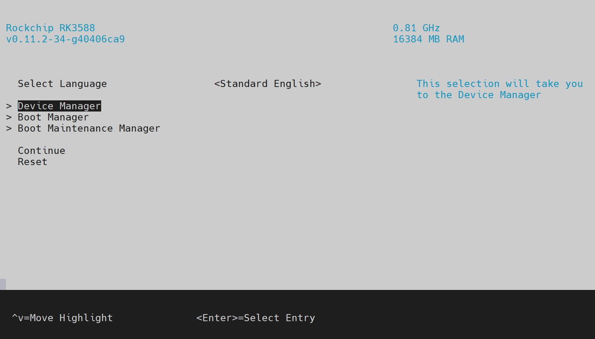

# EDK2 UEFI firmware for Rockchip RK3588 platforms
An EDK2-based UEFI firmware for RK3588 boards, giving them a PC-like standardized boot experience across Windows, Linux, BSD and VMware ESXi.

A fork of [edk2-porting/edk2-rk3588](https://github.com/edk2-porting/edk2-rk3588), which has seen no commits since December 2025. This fork picks the work back up — finishing what is still incomplete in the firmware, keeping the device trees tracking upstream Linux, and maintaining it for the foreseeable future.



# Supported platforms
**Platinum** boards work with mainline Linux device trees and, where they have Ethernet, use the integrated GMAC or a Realtek PCIe NIC. **Bronze** boards miss one of those or lack the validation to be confident in them, and fall back to `Vendor` mode.

The list changes as boards gain support or fall behind.

## Platinum
- [Radxa ROCK 5B](https://radxa.com/products/rock5/5b/) / [5B+](https://radxa.com/products/rock5/5bp) / [5A](https://radxa.com/products/rock5/5a/) / [5 ITX](https://radxa.com/products/rock5/5itx/)
- [Orange Pi 5](http://www.orangepi.org/html/hardWare/computerAndMicrocontrollers/details/Orange-Pi-5.html) / [5 Plus](http://www.orangepi.org/html/hardWare/computerAndMicrocontrollers/details/Orange-Pi-5-plus.html)
- [FriendlyELEC NanoPC T6](https://wiki.friendlyelec.com/wiki/index.php/NanoPC-T6) / [CM3588-NAS](https://wiki.friendlyelec.com/wiki/index.php/CM3588_NAS_Kit) / [NanoPi R6C](https://wiki.friendlyelec.com/wiki/index.php/NanoPi_R6C) / [R6S](https://wiki.friendlyelec.com/wiki/index.php/NanoPi_R6S)
- [Khadas Edge2](https://www.khadas.com/edge2)
- [Firefly ITX-3588J](https://en.t-firefly.com/product/industry/itx3588j)
- [BuzzTV P6](https://buzztvglobal.com/products/powerstation-6)
- [Mekotronics R58 Mini](https://www.mekotronics.com/h-pd-76.html)
- [ameriDroid Indiedroid Nova](https://indiedroid.us)

## Bronze
- [Fydetab Duo](https://fydetabduo.com/)
- [Firefly AIO-3588Q](https://en.t-firefly.com/product/industry/aio3588q) / [ROC-RK3588S-PC](https://en.t-firefly.com/product/industry/rocrk3588spc) (= [StationPC Station M3](https://www.stationpc.com/product/stationm3))
- [Mekotronics R58X](https://www.mekotronics.com/h-pd-75.html)
- [Mixtile Blade 3](https://www.mixtile.com/blade-3)
- [FriendlyELEC NanoPi M6](https://wiki.friendlyelec.com/wiki/index.php/NanoPi_M6)
- [Hinlink H88K](http://www.hinlink.com)

# Supported OSes
## Device Tree mode (recommended for Linux)
| Mode | OS | Notes |
| --- | --- | --- |
| `Mainline` | Generic upstream Linux, kernel 7.2+<br>Tested: Debian 13 (7.1.8) | Platform and kernel dependent — see [Collabora's RK3588 upstream status](https://gitlab.collabora.com/hardware-enablement/rockchip-3588/notes-for-rockchip-3588/-/blob/main/mainline-status.md).<br>Device trees are built from [devicetree-rebasing](https://git.kernel.org/pub/scm/linux/kernel/git/devicetree/devicetree-rebasing.git) `v7.2-dts`: boards carried upstream use that file directly, the rest are maintained in `devicetree/mainline`.<br>Kernels older than 6.15 have no display output; see [Device Tree configuration](#device-tree-configuration). |
| `Vendor` | Rockchip SDK Linux, kernel 5.10/6.1<br>Tested: [Armbian rk3588-live-iso](https://github.com/amazingfate/rk3588-live-iso) | Platform dependent, most peripherals work. |

`Mainline` is the default on [Platinum](#platinum) boards; [Bronze](#bronze) falls back to `Vendor`.

## ACPI mode
Developed and tested against **Windows 11** only — see the [driver support status](https://github.com/worproject/Rockchip-Windows-Drivers#hardware-support-status).

NetBSD 10 and VMware ESXi Arm Fling (>= 1.12) also boot, with display, USB, PCIe, SATA and eMMC between them; on ESXi, PCIe devices hang at boot unless disabled or unpopulated. Linux boots too but is **not recommended**: ethernet needs `CONFIG_DWMAC_DWC_QOS_ETH` — the only stmmac front end that binds under ACPI — and some distributions (Debian among them) do not build it. Use Device Tree mode for Linux.

# Supported peripherals in UEFI
Devices relevant to the firmware itself, not the OS. Applies to all platforms unless [noted below](#platform-specific-notes).

| Device | Status | Notes |
| --- | --- | --- |
| USB 3 / 2.0 / 1.1 | 🟢 Working | Host-mode only. With a FUSB302 the firmware matches the plug orientation, so devices enumerate either way up; without one, only one orientation works. SuperSpeed also needs both SS pairs routed to the connector — where they are not, a flipped plug falls back to high speed. |
| PCIe 3.0 / 2.1 | 🟢 Working | |
| SATA | 🟢 Working | |
| SD/eMMC | 🟢 Working | |
| HDMI output | 🟢 Working | |
| DisplayPort output (USB-C) | 🟢 Working | Detection goes through DisplayPort Alt Mode, as the SoC has no hot-plug detect wire on this path. EDID and link training need the Type-C sideband (SBU) routed to the connector; where a board does not route it, the firmware drives a default timing blind. Some displays may not work regardless. |
| eDP output | 🟡 Partial | Disabled; needs per-panel configuration. A platform setting `RK_ANALOGIX_DP_ENABLE` must also implement `EdpEnableBacklight()` in its `RockchipPlatformLib` — none does today, so the flag alone will not link. |
| DSI output | 🟢 Working | Fydetab Duo only. Needs per-panel configuration. |
| GMAC Ethernet | 🟢 Working | |
| Realtek PCIe Ethernet | 🟢 Working | Some boards ship without a factory MAC; see [Networking does not work](#networking-does-not-work). |
| Low-speed (GPIO/UART/I2C/SPI/PWM) | 🟢 Working | UART2 console at 1500000 baud. |
| SPI NOR Flash | 🟢 Working | |
| HYM8563 real-time clock | 🟢 Working | |
| RNG | 🟢 Working | `EFI_RNG_PROTOCOL` is backed by TF-A's SMCCC TRNG. `RngLib` — linked directly by `TlsDxe`, `Hash2DxeCrypto` and `IScsiDxe` — is backed by the SoC's hardware TRNG at `0xfe378000` (the block mainline drives as `rockchip,rk3588-rng`), falling back to the performance counter if the block does not identify itself. Opt out with `RK3588_TRNG_ENABLE = FALSE`. |
| Cooling fan | 🟢 Working | Most platforms. Uses the fan connector where present, otherwise the GPIO header for 3-pin PWM fans — Orange Pi 5 `GPIO4_B2`, Indiedroid Nova `GPIO4_B4`. Do *not* connect 2-pin fans there. |
| Status LED | 🟢 Working | |
| Voltage regulators (RK806/RK860) | 🟢 Working | |
| FUSB302 USB Type-C Controller | 🟢 Working | Plug orientation, sink and source power delivery, and DisplayPort Alt Mode. Enabled on every board that has one; Fydetab Duo, Blade 3, NanoPi R6C/R6S/M6 and ROCK 5A have none. State is sampled once at startup, so a cable plugged in later is not noticed. |

## Platform-specific notes
Deviations from the table above, plus what each board's Device Tree describes in Device Tree mode.

| Platform | Notes |
| --- | --- |
| BuzzTV PowerStation 6 | FUSB302 enabled (orientation, power delivery, DP Alt Mode); the port supplies 5 V to a sink. Only one SuperSpeed pair reaches the connector, so a flipped plug enumerates at high speed. The sideband is not routed either, so DisplayPort output is blind — no EDID, no link training. |
| Mekotronics R58 Mini | No SD card slot, so SD support is not built.<br>FUSB302 configured for orientation, power delivery and DP Alt Mode, supplying 5 V to a sink.¹<br>All four outputs are wired one per video port: HDMI0 on VP0, the DisplayPort connector on VP1, HDMI1 on VP2, USB-C DisplayPort on VP3. Four displays and four video ports makes the assignment forced, and VP3 is the smallest (2048x1536, 200 MHz), so the Type-C output runs to about 1080p60.<br>The DisplayPort connector is not fitted on every revision; it is described either way, and where absent the port simply never reports a display.<br>`vdd_log_s0` is held up across suspend, matching the vendor tree. |
| Firefly ITX-3588J | Adds the second HDMI output (VP1), HDMI input, the microSD slot, Bluetooth on uart6 and the Wi-Fi enable line — upstream describes none of them. Both RGMII PHYs also get their reset lines, which upstream leaves floating.¹<br>Bluetooth `BT_REG_ON` is taken as `GPIO0_C6`. The vendor tree claims that pin twice, for Bluetooth reset and for the LCD touch panel reset, so if a touch panel is fitted one of the two is wrong.<br>`vdd_log_s0` is held up across suspend, matching the vendor tree. |
| Firefly ITX-3588J<br>FriendlyELEC CM3588-NAS<br>Radxa ROCK 5 ITX | Type-C is sink-only in firmware. Each board's VBUS enable is either undescribed or — on the ITX-3588J — behind the PCA9555 expander, which the firmware's GPIO PCDs cannot address. |
| Khadas Edge2 | Mainline Device Tree wires USB-C DP Alt Mode (FUSB302 on i2c2, two DP lanes alongside USB 3). HDMI0 takes VP0 and DP0 takes VP2, as the Khadas vendor tree does.¹ |
| Orange Pi 5 Plus | Adds USB-C DP Alt Mode. Upstream wires the port for USB and orientation only — no alt modes, no `dp0` node, and the two-endpoint USBDP PHY graph has nowhere to attach one. The graph is rebuilt on the four-endpoint binding and DP0 routed through VP2, as the vendor does; VP0 and VP1 are taken by HDMI, and VP3 would cap the port at 1080p.¹ |
| Radxa ROCK 5B / 5B+ | The Type-C controller is disabled in the mainline Device Tree on purpose: the board is powered over USB-C, and a power-delivery contract negotiated as late as kernel probe makes the supply issue a hard reset. The firmware establishes the contract before the OS starts, which is what that needs.¹ If a board reboots during firmware startup, unset `RK_FUSB302_ENABLE` in its platform `.dsc`. |
| Radxa ROCK 5 ITX | The connector labelled HDMI0 is really DP1 behind an on-board DP-to-HDMI bridge, wired to VP2; HDMI1 is the one on VP1. Board wiring, not something the firmware can route around. |
| FriendlyELEC NanoPC-T6<br>NanoPi R6C / R6S<br>CM3588-NAS | The factory MAC address EEPROM on i2c6 is not described by the mainline Device Tree, so the address on the sticker is not the one in use. The firmware supplies a stable address derived from the SoC's OTP instead, so it does not change between boots. |
| FriendlyELEC CM3588-NAS | All four M.2 slots run as Gen3 x1 off the bifurcated PCIe 3 PHY. Slots 2 and 4 hang off the `pcie2x1l0` and `pcie2x1l1` controllers, which the firmware used to enable only when their combo PHY was in PCIe mode — so they never appeared, in UEFI or in the OS ([upstream#259](https://github.com/edk2-porting/edk2-rk3588/issues/259)). Fixed here, but untested on hardware. |
| FriendlyELEC NanoPi R6C / R6S | eMMC raised from HS200 to HS400 with enhanced strobe, matching FriendlyELEC's own tree for the nanopi6 family and the NanoPC-T6 upstream.¹ |
| Fydetab Duo | No HDMI output — the display controller is not enabled here.<br>SD card is limited to high-speed modes; DDR50/SDR50/SDR104 are disabled because UHS-I is unreliable on this board. |
| Mekotronics R58X | eMMC HS400 is disabled; the eMMC is unusable with it enabled. |
| ameriDroid Indiedroid Nova | No GMAC Ethernet exposed, no status LED. |
| Mixtile Blade 3 | No GMAC Ethernet exposed, no status LED.<br>Requires a fixed input voltage *higher than* 5 V — USB-PD negotiation is not supported by firmware. |

¹ Not yet verified on hardware.

# Getting started
## 1. Requirements
* One of the [supported boards](#supported-platforms).
* Storage for the firmware: SPI NOR flash (included with some boards), SD card or eMMC.
* A power supply good for at least 15 W — more depending on peripherals. On Mixtile Blade 3 this must be a fixed voltage *above* 5 V, or the board cannot power external peripherals.
* An HDMI (preferred) or USB-C DisplayPort screen.
* Optionally, a UART adapter capable of 1500000 baud (e.g. CH340, CP2104) for debugging or if no display is available.

## 2. Download the firmware image
Latest release: <https://github.com/C-Prime90/edk2-rk3588/releases>

If your board is not supported, do **not** use an image meant for another one. They look similar, but voltage setup can differ and you may damage the board.

## 3. Flash the firmware
> [!WARNING]
> This erases data on the target storage. Back up first.

* **Removable SD or eMMC** (easiest): balenaEtcher, RPi Imager or `dd`.
* **SPI NOR or soldered eMMC**: flash from Linux running on the board, or use RKDevTool from another computer with the board in Maskrom mode. See <https://docs.radxa.com/en/rock5/lowlevel-development/bootloader_spi_flash>. Entering Maskrom varies by board — check vendor documentation.

SPI NOR is recommended where present: it leaves the other storage free, and lets the firmware reach its own variable store while an OS is running. (That store is mostly used by OS installers to create boot entries; it is not mandatory.)

To share one SD/eMMC between UEFI and an OS, flash UEFI first, then add partitions without touching the first reserved one. See [Updating the firmware](#updating-the-firmware) for how to update in that case.

## 4. Connect peripherals and power on
You should see the status LED blinking (if present), then the boot logo with a progress bar.

From there: <kbd>Esc</kbd> enters firmware setup, <kbd>F1</kbd> launches the UEFI Shell, or the system boots an installed UEFI bootloader automatically if you do nothing.

See [Supported OSes](#supported-oses), [Supported peripherals](#supported-peripherals-in-uefi) and the configuration options below — some may need changing for your OS. If something goes wrong, see [Troubleshooting](#troubleshooting).

# Configuration settings
CPU frequency, PCIe/SATA selection for M.2 ports, fan control and more live under `Device Manager` -> `Rockchip Platform Configuration`. The menus carry their own help text.

## Boot time optimization
* Disable unused M.2/PCIe slots to skip initialization: `Rockchip Platform Configuration` -> `PCIe/SATA/USB Combo PIPE PHY`, set the relevant PHYs to `Unconnected`, and set `PCI Express 3.0` -> `Support State` to `Disabled`.
* Reduce the auto-boot timeout in `Boot Maintenance Manager`.
* If you do not network boot: `Device Manager` -> `Network Stack Configuration`, uncheck `Network Stack`.
* If you do not need display hot-plug or DisplayPort inside the firmware: `Rockchip Platform Configuration` -> `Display`, set `Force Output` to `Disabled`.
* By default all boot devices are connected regardless of need, for compatibility. The cost is negligible and changing it is not recommended, but it lives in `Boot Maintenance Manager` -> `Boot Discovery Policy`.

## Linux boot
If a distro throws a Synchronous Exception at boot, go to `Device Manager` -> `EFI Memory Attribute Protocol` and uncheck `Enable Protocol`.

## Device Tree configuration
For full Linux support, use Device Tree mode: `Device Manager` -> `Rockchip Platform Configuration` -> `ACPI / Device Tree`, set `Config Table Mode` to `Device Tree`. See [Supported OSes](#device-tree-mode-recommended-for-linux) for what `Mainline` and `Vendor` mean.

> [!TIP]
> In `Mainline` mode with kernels older than 6.15, HDMI output will not work. To use the UEFI-initialized display instead, enable `Force UEFI GOP Display` in the same menu. GPU acceleration cannot work this way, and kernels that old are outside what these device trees target.

### Custom DTB override and overlays
Useful when the firmware DTB is outdated, does not match your kernel, or for testing. Enable `Support DTB override & overlays` in the menu above; the firmware then searches all supported file systems (FAT, ext4) on the boot device.

Paths are relative to the partition root and must not be nested deeper. The base DTB and all overlays must live on the **same** partition.

| What | Where | Name |
| --- | --- | --- |
| Base DTB | `\dtb`, `\dtb\base`, or `\dtb\rockchip` (where Fedora keeps kernel DTBs) | `<PLATFORM-DT-NAME>.dtb` |
| Overlays, all platforms | `\dtb\overlays` | `*.dtbo` |
| Overlays, one platform | `\dtb\overlays\<PLATFORM-DT-NAME>` | `*.dtbo` |

Custom paths can be set via `Preferred Base DTB Path` and `Preferred Overlays Path`.

`<PLATFORM-DT-NAME>` is one of:

| Platform | Name | Platform | Name |
| --- | --- | --- | --- |
| ROCK 5B | `rk3588-rock-5b` | R58X (v1.2) | `rk3588-blueberry-edge-v12-linux` |
| ROCK 5B+ | `rk3588-rock-5bp` | R58 Mini | `rk3588-blueberry-minipc-linux` |
| ROCK 5A | `rk3588s-rock-5a` | Edge2 | `rk3588s-khadas-edge2` |
| ROCK 5 ITX | `rk3588-rock-5-itx` | Blade 3 | `rk3588-blade3-v101-linux` |
| Orange Pi 5 | `rk3588s-orangepi-5` | NanoPC T6 | `rk3588-nanopc-t6` |
| Orange Pi 5 Plus | `rk3588-orangepi-5-plus` | NanoPC CM3588-NAS | `rk3588-nanopc-cm3588-nas` |
| Indiedroid Nova | `rk3588s-9tripod-linux` | NanoPi R6C | `rk3588s-nanopi-r6c` |
| Fydetab Duo | `rk3588s-fydetab-duo` | NanoPi R6S | `rk3588s-nanopi-r6s` |
| PowerStation 6 | `rk3588-buzztv-p6` | NanoPi M6 | `rk3588s-nanopi-m6` |
| Firefly AIO-3588Q | `aio-3588q` | H88K | `rk3588-hinlink-h88k` |
| Firefly ITX-3588J | `itx-3588j` | ROC-RK3588S-PC / Station M3 | `roc-rk3588s-pc` |

Notes:
* The firmware fixes up the DTB from your settings (e.g. PCIe/SATA selection, which makes SATA overlays redundant). This does **not** happen when the DTB comes from elsewhere, such as Grub's `devicetree` command.
* Overlays apply to the firmware-provided DTB unless a base override is given. If one overlay fails, all are discarded; if the base override is invalid, the firmware's own DTB is used.
* Errors appear only on the [serial console](#advanced-troubleshooting).

# Updating the firmware
If the storage holds only UEFI, flash the new image as in [Getting started](#getting-started).

If it is shared with an OS, apply only the firmware part, skipping the GPT:
```bash
dd if=FIRMWARE.img of=DESTINATION bs=512 skip=64 seek=64 conv=notrunc
```
`FIRMWARE.img` is your board's image (e.g. `edge2_UEFI_Release_v0.8.img`); `DESTINATION` is the target device (e.g. `/dev/sdb`). This starts at offset 0x8000 — see [Flash layout](#flash-layout).

## Flash SPI NOR from the UEFI Shell
1. Copy the image to a FAT32 partition and connect it to the board.
2. Launch the UEFI Shell — <kbd>F1</kbd> during boot, or `Boot Manager` -> `UEFI Shell`.
3. Find the partition: `map` lists file systems (`fs0:`, `fs1:`, …); `ls fsX:` shows contents. Type the name and press <kbd>Enter</kbd> to switch to it.
4. Run `sf updatefile FIRMWARE.img 0x0` and wait.
5. Reboot.

# Troubleshooting
> [!IMPORTANT]
> Make sure the board can only load this firmware. **U-Boot must not be present on SPI NOR, SD or eMMC** — it can take precedence and cause problems.

## Meaning of the Status LED
| Pattern | Meaning |
| --- | --- |
| Fast pulsing | Firmware initializing (usually under 5 seconds). |
| Short pulse every ~2 seconds | Ready, waiting for input or the boot countdown. Display should be live. |
| Stops blinking | Booting an OS — expected only at this point. |
| Never lights up | Firmware did not load at all. |
| Stuck on or off after a few blinks | Firmware crashed or froze. |

## Recovery
UEFI provides a Maskrom boot option via the Boot Manager or <kbd>F4</kbd> at the splash screen, for when the button is awkward to reach. Holding Recovery (or volume up) while powering on also enters Maskrom.

## Nothing shows up on the screen
Most often the firmware is the wrong one for the board, or was flashed incorrectly — check that first. Otherwise:
* The display must support at least 640x480 @ 60 Hz.
* Boot with no display attached, then plug it in once the LED pattern changes. This forces the minimum resolution, which you can then raise under `Rockchip Platform Configuration` -> `Display`.
* On a board without a FUSB302, USB-C to DisplayPort works in only one orientation — try both.

If nothing works, the [serial console](#advanced-troubleshooting) is the only way in.

## Configuration settings do not get saved
Seen when firmware is present on more than one device (SPI NOR, eMMC, SD). The firmware now keeps its variable store on the medium it actually booted from, so an SD card carrying a second copy no longer takes the eMMC's place — but if the store still does not stick, erase the firmware from the devices you are not booting.

## NVMe is not detected at boot
`phy_rockchip_naneng_combphy` drives the PCIe combo PHYs and has to be loaded before the root filesystem mounts. Distributions that do not autoload it early — NixOS at least — need it named explicitly, e.g. `boot.initrd.availableKernelModules = [ "nvme" "phy_rockchip_naneng_combphy" ];`. See [upstream#217](https://github.com/edk2-porting/edk2-rk3588/issues/217).

## USB 3 devices do not work
Try another port, try the other USB-C orientation (3.0 works in only one without a FUSB302), and check the power supply and cable.

## Networking does not work
Only the integrated GMAC, Realtek PCIe and USB controllers are supported.

Some Realtek NICs ship without a factory MAC and show as all zeros, which can stop the adapter getting an IP. It can be burned into the eFuses from Linux on the board (commands below are for Armbian with the legacy kernel):

```bash
sudo apt install -y linux-headers-legacy-rk35xx
git clone https://github.com/redchenjs/rtnicpg && cd rtnicpg && make

sudo rmmod pgdrv && sudo ./pgload.sh    # no other Realtek module may stay loaded

sudo ./rtnicpg-aarch64-linux-gnu /efuse /nodeid 00E04C001234          # single NIC
sudo ./rtnicpg-aarch64-linux-gnu /efuse /# 1 /nodeid 00E04C001234     # first of several
```

Generate addresses at <https://www.macvendorlookup.com/mac-address-generator>. If `r8125` is built in, boot with `initcall_blacklist=rtl8125_init_module` (via Grub) first.

> [!WARNING]
> The eFuses are limited — a MAC can only be changed a few times.

## Wi-Fi / Bluetooth not working on mainline Linux
Usually missing upstream firmware blobs; check `dmesg` for load errors and copy them into `/usr/lib/firmware`. For example, on Khadas Edge2 with an onboard AP6275P (BCM/SYN43752):

```bash
cd /usr/lib/firmware/brcm/
B=https://github.com/armbian/firmware/raw/refs/heads/master/brcm
sudo wget $B/brcmfmac43752-pcie.bin $B/brcmfmac43752-pcie.clm_blob \
          $B/brcmfmac43752-pcie.txt $B/BCM4362A2.hcd
```

then reboot.

## Advanced troubleshooting
A debug build logs in detail to the serial console — see the [release notes](https://github.com/C-Prime90/edk2-rk3588/releases) for how to get one.

1. Flash the debug image in place of the existing one.
2. Connect **UART2** RX, TX and GND (check vendor documentation) to a UART adapter.
3. Open a serial terminal at 1500000 baud, 8n1.
4. Power on.

If nothing appears, swap RX/TX and check the adapter. If you need help reading the logs, open an issue.

# Reporting issues
<https://github.com/C-Prime90/edk2-rk3588/issues> — check for an existing report first, and include expected vs actual behavior, steps to reproduce and [serial logs](#advanced-troubleshooting).

# Building
Linux only; use WSL on Windows.

1. Install dependencies:
   ```bash
   # Ubuntu/Debian
   sudo apt install git gcc g++ build-essential gcc-aarch64-linux-gnu acpica-tools python3-pyelftools uuid-dev python-is-python3 device-tree-compiler
   ```
   ```bash
   # Arch
   sudo pacman -S git base-devel gcc dtc aarch64-linux-gnu-binutils aarch64-linux-gnu-gcc aarch64-linux-gnu-glibc python python-pyelftools iasl --needed
   ```
2. Clone and build ([platform configs](https://github.com/C-Prime90/edk2-rk3588/tree/master/configs)):
   ```bash
   git clone https://github.com/C-Prime90/edk2-rk3588.git --recursive
   cd edk2-rk3588
   ./build.sh --device rock-5b --release Release   # or Debug
   ```

Build errors are usually missing dependencies — the lists above are not exhaustive and vary by distro.

# Notes
## Flash layout
| Address | Size | Description | File |
| --- | --- | --- | --- |
| 0x00000000 | 0x00004400 | GPT Table | rk3588_spi_nor_gpt.img |
| 0x00008000 | | IDBlock | idblock.bin |
| 0x00100000 | 0x00500000 | BL33_AP_UEFI FV | ${DEVICE}_EFI.itb |
| 0x007C0000 | 0x0001E000 | NV_VARIABLE_STORE | |
| 0x007DE000 | 0x00004000 | NV_FTW_WORKING | |
| 0x007E2000 | 0x0001E000 | NV_FTW_SPARE | |

The variable store is not part of the flash image, so updates do not overwrite your settings. The firmware expects these exact offsets — do not change them.

The store is 120K, raised from 64K ([upstream#234](https://github.com/edk2-porting/edk2-rk3588/issues/234)). It cannot grow further without moving its base address, which is what carries settings across an update: the three regions have to be contiguous, fault-tolerant write needs a spare area at least as large as the store itself, and the whole set has to fit in the 256K between the base and the end of the 8MB device.

> **Updating from a release with the old 64K layout resets your UEFI settings once.** The firmware checks the recorded volume size against the one it expects and rebuilds the store when they disagree, so boot entries and anything set in the setup menu go back to defaults on that first boot. Later updates are unaffected.

## Memory map
| Address | Size | Description | File |
| --- | --- | --- | --- |
| 0x00040000 | | ATF | bl31_0x00040000.bin |
| 0x000f0000 | | ATF | bl31_0x000f0000.bin |
| 0x00200000 | 0x00500000 | UEFI FV | BL33_AP_UEFI.Fv |
| 0x007C0000 | 0x00010000 | NV_VARIABLE_STORE | |
| 0x007D0000 | 0x00010000 | NV_FTW_WORKING | |
| 0x007E0000 | 0x00010000 | NV_FTW_SPARE | |
| 0x08400000 | | OP-TEE | bl32.bin |
| 0xff100000 | | ATF (PMU_MEM) | bl31_0xff100000.bin |

## Licenses
Most UEFI code uses the default EDK2 license, [BSD-2-Clause-Patent](https://github.com/tianocore/edk2/blob/master/License.txt). Components ported from Linux and Rockchip's U-Boot fork are **GPL-2.0** — check `SPDX-License-Identifier`. Blobs in `misc/rkbin/` are covered by [rkbin's license](https://github.com/rockchip-linux/rkbin/blob/master/LICENSE), though it also contains binaries built from U-Boot (SPL), Arm Trusted Firmware and OP-TEE under their own licenses.

## Community
* Hack w/ Rockchip Telegram: <https://t.me/UEFIonRockchip>
* Windows on R Discord: <https://discord.gg/vjHwptUCa3>

## Credits & alternatives
Based on Rockchip's initial work at <https://gitlab.com/rk3588_linux/rk/uefi-monorepo>.

For RK356x, see [quartz64_uefi](https://github.com/jaredmcneill/quartz64_uefi), from which some code here is reused.
